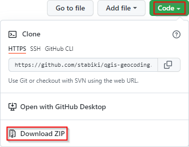
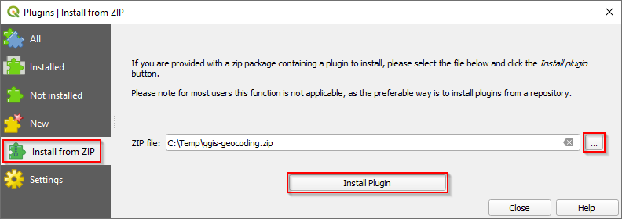
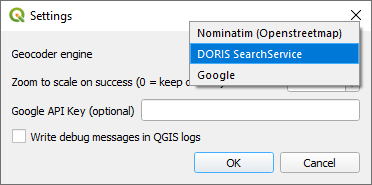

QGIS Python geocoding and reverse geocoding plugin forked from [elpaso/qgis-geocoding](https://github.com/elpaso/qgis-geocoding) with, additionally, the Austrian [DORIS SearchService](https://www.doris.at/service/api_searchservice.aspx) geocoder engine.

## Installation

Download a ZIP file containing the code:

Install the plugin from the downloaded ZIP file via the QGIS plugin manager:

Choose `DORIS SearchService` as geocoder engine in the plugin's settings:

